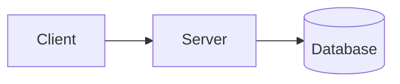

# Visual output in Omnigent

Applies whichever harness you are — Claude, Codex, or dvsc — whenever your
message is rendered in Omnigent's chat UI. Check `$OMNIGENT` (also
`$OMNIGENT_URL`, `$OMNIGENT_RUNNER_LAUNCH_HARNESS`). If it is unset you are in a
plain terminal: mermaid will NOT render, so use ASCII instead.

## Diagrams: emit a mermaid fence

This is the only thing that renders a diagram inline. Fence language is
`mermaid`, lowercase:

````

````

Chat markdown goes through Streamdown, and `@streamdown/mermaid` is registered
in `STREAMDOWN_PLUGINS` (`web/src/components/ai-elements/streamdown-security.ts`),
consumed by `MessageResponse` (`web/src/components/ai-elements/message.tsx`) —
the single component behind every assistant and user bubble. Covered by an
end-to-end render test, `tests/e2e_ui/chat/test_chat_mermaid_diagram.py`, which
asserts a real `[data-streamdown="mermaid-block"]` SVG in an assistant message.

No diagram-type allowlist — the plugin is registered bare, so anything
mermaid.js supports works. Flowchart is the proven case.

### Limits that silently kill it

Above any of these the message bypasses the markdown pipeline entirely and
renders as plain monospace text — no error, just no diagram
(`web/src/components/blocks/ChatMarkdown.tsx`):

- message text > 50,000 chars
- any unbroken token > 5,000 chars
- plaintext display > 200,000 chars

Always close the fence. Mid-stream the block shows as code and settles into a
diagram once the closing fence arrives (100 ms re-parse throttle). A diagram
that fails to render degrades to its markdown source via `MarkdownErrorBoundary`
rather than blanking the app, so a broken diagram costs nothing.

## Everything else is a dead end

- **`` is blocked.** The harden pass is rewritten with
  `allowedImagePrefixes: []` to stop URL-based exfiltration. It renders as the
  literal text `[Image blocked: alt]`. This applies to *every* host, internal or
  public — do not go looking for one that works.
- **Raw `<svg>` / HTML is sanitized.** There is no `rehype-raw`; the pipeline
  asserts a sanitize step is present.
- **Tool results cannot return an image.** MCP `ImageContent` is
  JSON-stringified into tool-result text, and the block renderer has no `image`
  case.
- **A markdown link to a workspace file** becomes a FileViewer button — a click,
  not inline rendering.

## When a raster really is needed

Sometimes a PNG is the right artifact (pasting into a doc, richer layout than
mermaid allows). Render it locally — Graphviz `dot` is installed — write it
somewhere durable, and hand Matt the path plus an internal link.

Upload with `meta pixelcloud.image upload --file=file://$PWD/x.png` (the
`file://` prefix is required). Give the resulting `pxl.cl` URL as an ordinary
markdown **link**, never as `![...]`, which would be stripped.

Never upload Meta-internal architecture to `google-mux` or any publicly
fetchable host. It buys nothing here — the image would be blocked inline anyway
— and it publishes confidential material to a URL that may be cached after
deletion.

## Outside Omnigent

Fall back to ASCII. When writing a durable design doc, the house style in
`~/repos/omnigent/docs/` is to keep both: a ```mermaid fence plus an "ASCII view
(same design, for non-mermaid renderers)" beside it.
