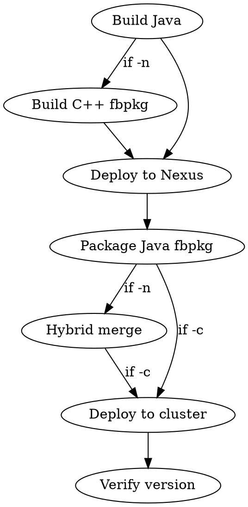

# Presto Deploy

## Overview

Handles the full Nexus deploy, fbpkg packaging, and cluster deployment pipeline.

**Prerequisites:** `feature install warehouse`, Nexus credentials in `~/.m2/settings.xml`

**Key script:** `~/.claude/skills/presto-deploy/presto-deploy`

**Depends on:** `~/.claude/skills/presto-build/presto-build` (sourced for Maven config and build functions)

**Related skills:**
- `presto-build` — Local development builds, module builds, tests
- `presto-test` — Post-deployment validation (verifier, goshadow, BEEST)

## Workflow



## Quick Reference

| Task | Command |
|------|---------|
| Full build + deploy + fbpkg | `presto-deploy` |
| Skip OSS rebuild | `presto-deploy -T` |
| Hybrid (Java + C++ opt) | `presto-deploy -n` |
| Hybrid with BOLT | `presto-deploy -n -m bolt` |
| Reuse existing Java fbpkg | `presto-deploy -J <hash>` |
| Hybrid with existing Java | `presto-deploy -J <hash> -n` |
| Build + deploy + push to cluster | `presto-deploy -c <cluster> -r "reason"` |
| Full hybrid + push to cluster | `presto-deploy -n -c <cluster> -r "reason"` |

## Nexus Deployment

The script runs `mvn deploy` on `presto-facebook-trunk` and extracts the deployed version from the upload log. The deploy log is written to `/tmp/presto_dev_deploy.log`.

The deployed version string (e.g., `0.297-20260212.123456-31`) is used to create the fbpkg.

## fbpkg Packaging

### Java fbpkg

After Nexus deployment, the script runs `pt build fbpkg presto <version>` to create a `presto.presto:<hash>` fbpkg. The hash is printed and used for cluster deployment.

### C++ fbpkg

When `-n` is specified, the script builds a C++ fbpkg via `fbpkg build fbcode//fb_presto_cpp:<target>`.

| Mode | fbpkg target | Notes |
|------|-------------|-------|
| opt | `presto.presto_cpp` | Default for packaging |
| bolt | `presto.presto_cpp_bolt` | BOLT optimization (requires ThinLTO) |
| asan | `presto.presto_cpp_asan` | Address sanitizer |
| tsan | `presto.presto_cpp_tsan` | Thread sanitizer |
| dbgo | `presto.presto_cpp_dbgo` | Debug optimized |

`dev` mode cannot be packaged — use `presto-build -n` for local C++ dev builds.

### Hybrid merge

When both Java and C++ fbpkgs are produced, the script delegates to `fb_presto_cpp/scripts/build.sh` which merges them into a single `presto.presto` package containing the Java coordinator and C++ worker binary.

## Cluster Operations

### Reservation

```bash
pt reservation list
pt reservation reserve <cluster_name> <duration>
pt reservation extend <cluster_name> <duration>
pt reservation release <cluster_name>
```

Katchin dashboard: search "Katchin" on internal tools.

### Deployment methods

**Via presto-deploy (recommended):**

```bash
presto-deploy -c <cluster> -r "testing feature X"
```

**Via pt tools (manual):**

```bash
pt pcm deploy -l -c <cluster_name> -pv <version> -r "reason" -f
```

**Via tw update (direct TW manipulation):**

```bash
PRESTO_VERSION=<version> tw update \
  ~/fbsource/fbcode/tupperware/config/presto/testing/katchin.tw \
  '.*<cluster_name>.*(coordinator|worker|resource_manager)' --fast
```

### Verify deployment

```bash
presto --smc <cluster_name> --execute "SELECT version()"
```

## Common Issues

| Problem | Fix |
|---------|-----|
| `mvn deploy` fails with auth error | Check Nexus credentials: `cat ~/.m2/settings.xml` |
| fbpkg build fails | Ensure `mvn deploy` succeeded; check `/tmp/presto_dev_deploy.log` |
| C++ fbpkg hash empty | Check `fbpkg build fbcode//fb_presto_cpp:<target>` output directly |
| Cluster shows old version after deploy | Wait for TW jobs to restart; check `tw job status tsp_pnb/presto/<cluster>.*` |
| `presto --smc` connection refused | Cluster may still be restarting; check TW job health |
