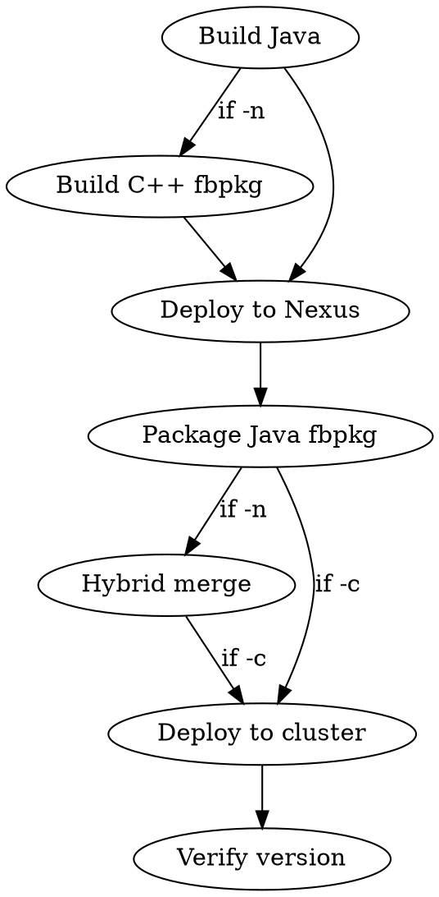

# Presto Deploy

## CRITICAL: Test Clusters Only

**You must NEVER deploy to production clusters.** You may only deploy to Katchin test clusters that you have personally reserved. Before every deployment, verify:

1. **The cluster is a test cluster.** Test cluster names contain `test`, `verifier`, or `katchin` (e.g., `dkl1_batchtest_bgm_3`, `atn1_verifier_t6_2`). If a cluster name does not clearly indicate it is a test cluster, **stop and ask the user to confirm**.
2. **You have an active reservation.** Run `pt pcm test-cluster list` and confirm the target cluster shows your reservation. If it does not, **do not deploy**.
3. **The TW config path is the test config.** When using `tw update`, always use the Katchin test config at `tupperware/config/presto/testing/katchin.tw` — never `tupperware/config/presto/presto.tw` or any other production config.

If there is any ambiguity about whether a cluster is a test cluster, **do not deploy**. Ask the user.

## Overview

Handles the full Nexus deploy, fbpkg packaging, and cluster deployment pipeline.

**Prerequisites:** `feature install warehouse`, Nexus credentials in `~/.m2/settings.xml`

**Key script:** `~/.claude/skills/presto-deploy/presto-deploy`

**Depends on:** `~/.claude/skills/presto-build/presto-build` (sourced for Maven config and build functions)

**Related skills:**
- `presto-build` — Local builds, unit tests, and checkstyle
- `presto-e2e-test` — End-to-end testing against remote clusters (correctness verification, performance regression)

## Workflow



## Quick Reference

| Task | Command |
|------|---------|
| Full build + deploy + fbpkg | `presto-deploy` |
| Skip OSS rebuild | `presto-deploy -T` |
| Hybrid (Java + C++ opt) | `presto-deploy -n` |
| Hybrid with BOLT | `presto-deploy -n -m bolt` |
| Reuse existing Java fbpkg | `presto-deploy -J <hash>` |
| Hybrid with existing Java | `presto-deploy -J <hash> -n` |
| Build + deploy + push to cluster | `presto-deploy -c <cluster> -r "reason"` |
| Full hybrid + push to cluster | `presto-deploy -n -c <cluster> -r "reason"` |

## Nexus Deployment

The script runs `mvn deploy` on `presto-facebook-trunk` and extracts the deployed version from the upload log. The deploy log is written to `/tmp/presto_dev_deploy.log`.

The deployed version string (e.g., `0.297-20260212.123456-31`) is used to create the fbpkg.

## fbpkg Packaging

### Java fbpkg

After Nexus deployment, the script runs `pt build fbpkg presto <version>` to create a `presto.presto:<hash>` fbpkg. The hash is printed and used for cluster deployment.

### C++ fbpkg

When `-n` is specified, the script builds a C++ fbpkg via `fbpkg build fbcode//fb_presto_cpp:<target>`.

| Mode | fbpkg target | Notes |
|------|-------------|-------|
| opt | `presto.presto_cpp` | Default for packaging |
| bolt | `presto.presto_cpp_bolt` | BOLT optimization (requires ThinLTO) |
| asan | `presto.presto_cpp_asan` | Address sanitizer |
| tsan | `presto.presto_cpp_tsan` | Thread sanitizer |
| dbgo | `presto.presto_cpp_dbgo` | Debug optimized |

`dev` mode cannot be packaged — use `presto-build -n` for local C++ dev builds.

### Hybrid merge

When both Java and C++ fbpkgs are produced, the script delegates to `fb_presto_cpp/scripts/build.sh` which merges them into a single `presto.presto` package containing the Java coordinator and C++ worker binary.

## Cluster Reservation

A test cluster must be reserved before deploying to it.

**`pt pcm test-cluster`** — the current tool:

```bash
# List available test clusters
pt pcm test-cluster list
pt pcm test-cluster list --available-only
pt pcm test-cluster list -r <region> -m <machine_type>

# Reserve a test cluster (defaults: 3 hours, 50 workers)
pt pcm test-cluster reserve --request-reason "<reason>"

# Reserve with specific duration, worker count, region, machine type
pt pcm test-cluster reserve -d "2 days" -w 10 -r <region> -m <machine_type> \
    --request-reason "<reason>"

# Reserve a specific cluster
pt pcm test-cluster reserve -c <cluster_name> -d "48 hours" --request-reason "<reason>"

# Extend a reservation
pt pcm test-cluster extend -c <cluster_name> -a "12 hours" --request-reason "<reason>"

# Release a reservation
pt pcm test-cluster release -c <cluster_name>
```

Machine types: `T1`, `T10`, `T6`, `T6F`, `T1_BGM`, `T10_SPR`, `T2`, `T2_TRN`.
Categories: `Warehouse Batch`, `Warehouse Batch Testing`.

**`pt reservation list`** — older tool, still useful for listing clusters filtered by service type:

```bash
pt reservation list
pt reservation list --reserved
pt reservation list --service PRESTISSIMO
```

`pt reservation reserve` and `release` are deprecated — use `pt pcm test-cluster` instead.

### Cluster Sizing

**Production batch clusters typically run 300 workers** (T1_BGM) or 150 workers (T2_TRN). Several Presto configuration parameters are derived from or scale with worker count, so running tests on a significantly smaller cluster produces different behavior. The default reservation is 50 workers — this is sufficient for correctness testing but **not for performance testing**.

**Worker-count-dependent configurations:**

| Config | How it scales | Impact of mismatch |
|--------|---------------|-------------------|
| `query.initial-hash-partitions` | `get_hash_partitions(worker_count, driver_count)`, capped at 333 | Fewer workers → fewer partitions → larger partitions → different shuffle/join behavior |
| `sink.max-buffer-size` | `ceil(0.64 * hash_partitions)` MB | Scales with hash partitions |
| Effective total query memory | `query.max-memory-per-node * worker_count` | 10 workers × 14GB = 140GB vs 300 workers × 14GB = 4.2TB — queries that fit in production may OOM or spill heavily on small clusters |
| `minimum_required_workers_active` | `worker_count * 0.75` | Small clusters start faster |
| Total cluster parallelism | `worker_count * task_threads` | 10 BGM workers = 1,700 threads vs 300 = 51,000 |

**Fixed configurations** (do NOT scale with worker count): `join-max-broadcast-table-size` (1GB), per-worker memory limits, per-worker spill limits (300GB), task thread counts.

**Sizing recommendations:**

| Test purpose | Recommended workers (`-w`) | Why |
|---|---|---|
| Correctness (BEEST, verifier) | 10-50 | Plan shapes may differ but correctness should hold |
| Performance A/B (goshadow/perfrun) | 100-300 | Need production-like hash partitions, memory, and parallelism for representative signal |
| Quick smoke test | 10 | Just checking it runs |

For A/B comparisons, what matters most is that both arms use the **same** cluster size — relative comparisons are valid even on a smaller cluster. But use at least 100 workers on BGM if you want results that generalize to production.

### Build Type for Performance Testing

For A/B performance comparisons, use `opt` (default), **not `bolt`**. BOLT's profile-guided optimization (PGO) is trained on production code paths, so it disproportionately optimizes whichever behavior is dominant in production. If you're testing whether a code path change (e.g., disabling TLS, changing a shuffle algorithm) improves performance, BOLT will have already optimized the *current* path — biasing results toward the control arm and underestimating the treatment's benefit.

`opt` builds apply the same optimization level uniformly across all code paths, giving a fair comparison.

```bash
# Default — opt build (fair for A/B)
presto-deploy -n -c <cluster> -r "Performance A/B arm"

# BOLT build — unfair for A/B, only use for production deployment
presto-deploy -n -m bolt -c <cluster> -r "Production-representative perf"
```

### Region Selection

Cluster region matters for two reasons:

1. **BEEST synthetic data availability:** BEEST synthetic data is replicated to local namespaces across regions, but not all suites have data everywhere. Prefer common regions (`atn`, `ftw`, `pnb`, `rcd`) where data is most likely present. Less common regions (`dkl`, `maz`, `mwg`, `ncg`) may be missing data for some suites.

2. **Cross-region reads:** Batch test clusters have `allowed_fb_regions` restricted to their local region (set in `batch_native.cinc` line 647). This means queries cannot access data in other regions — they'll fail with `PRISM_REGION_NOT_ALLOWED`. Katchin verifier clusters allow all regions by default (`allowed_fb_regions = "*"` via `utils.cinc` line 958).

### Reservation Checklist

Before reserving, determine:

| Consideration | Flag | Guidance |
|---|---|---|
| **Worker count** | `-w` | 10 for correctness, 100-300 for perf |
| **Region** | `-r` | Prefer `atn`, `ftw`, `pnb`, `rcd` for BEEST; match production region for goshadow |
| **Machine type** | `-m` | `T1_BGM` for standard batch (most common production type) |
| **Duration** | `-d` | Correctness: 2-3h. Perf A/B: 6-8h (deploy + control run + experiment run). |
| **Category** | `--category` | `"Warehouse Batch Testing"` for Prestissimo batch clusters |

```bash
# Typical performance testing reservation
pt pcm test-cluster reserve -w 300 -r rcd -m T1_BGM -d "8 hours" \
    --request-reason "Performance A/B: <description>"

# Typical correctness testing reservation
pt pcm test-cluster reserve -w 10 --request-reason "BEEST correctness: <description>"
```

### Modifying Cluster Config for Testing

Some tests require cluster-wide config changes that cannot be set via session properties (e.g., `internal-communication.https.required`, `allowed_fb_regions`). This section explains the config architecture and how to make these changes.

#### Tupperware Config Architecture

Presto cluster config is generated by Python code in `tupperware/config/presto/`. The generation flow:

1. A `.tw` file (e.g., `testing/katchin.tw`) defines clusters and calls `WarehouseBatchConfig(...)` constructors
2. The constructor (in `presto.cinc`) calls helper methods like `enable_https()`, sets ports, exchange settings, etc.
3. Post-construction overrides are applied via dict-style access on the config object
4. The TW spec is compiled into the final deployment config

**Key config files:**

| File | Role |
|------|------|
| `testing/katchin.tw` | Katchin test cluster definitions; per-cluster overrides |
| `include/configgen.cinc` | Core config generation helpers (`enable_https()`, `enable_auth()`, etc.) |
| `include/presto.cinc` | `WarehouseConfig` / `WarehouseBatchConfig` classes — assembles all config |
| `include/warehouse_config.cinc` | Shared/coordinator/worker `config.properties` defaults (ports, exchange, memory) |
| `include/bootstrap_configs/warehouse/batch.cinc` | Production batch cluster defaults |

All paths relative to `tupperware/config/presto/`.

#### Override Approaches

**Approach 1: Constructor-level override.** Modify the parameter passed to the config constructor. This changes config at generation time but may trigger validation constraints:

```python
# In katchin.tw, before config construction:
secure_internal_communications[cluster] = False    # disables internal HTTPS
hipster_acl_name[cluster] = None                   # must also clear this (see constraints below)
```

**Approach 2: Post-construction property override.** Override individual `config.properties` entries after the config object is built. This bypasses validation and is useful for changing one property while keeping everything else intact:

```python
# In katchin.tw, after the config construction loop (after ~line 261):
if cluster == "<your_cluster>":
    for ptype in ["coordinator", "worker", "resource_manager"]:
        cluster_job_configs[cluster].config_files[ptype]["config.properties"]["internal-communication.https.required"] = "false"
```

This is the same pattern already used in `katchin.tw` for catalog and other per-cluster overrides.

#### How `pt pcm deploy -l` Works

The `-l` / `--use-local-config` flag deploys the **entire TW config from your local working copy** (`~/fbsource/fbcode/tupperware/`). Any uncommitted changes to `.tw` or `.cinc` files take effect. Without `-l`, the tool uses a daily-published config snapshot (`tupperware_fbcode_config_snapshot:daily`), so local changes won't be picked up.

#### Workflow

1. **Modify the TW config file** using one of the approaches above.
2. **Validate:** `tw validate ~/fbsource/fbcode/tupperware/config/presto/testing/katchin.tw`
3. **Deploy with local config:** `echo "yes" | pt pcm deploy -c <cluster> -pv <version> -r "<reason>" -l -f`
   - Note: `tw job update` may be blocked by AI agent policy; `pt pcm deploy -l` works around this
4. **Verify the change took effect** (see below).
5. **Always revert the config change when done.**

#### Verifying Config Changes at Runtime

After deploying a config change, verify it took effect before running tests:

```bash
# Check a specific config property via the Presto info endpoint or logs
presto-test cli -c <cluster> -e "SELECT 1"   # basic connectivity

# For HTTPS toggle: run a multi-stage query and check coordinator logs
# for exchange location URIs — http://worker:7777 vs https://worker:7778
```

#### Common Config Properties Reference

| What | TW Parameter | Presto Property | Where Set |
|------|-------------|-----------------|-----------|
| Internal HTTPS | `secure_internal_communications` | `internal-communication.https.required` | `configgen.cinc` `enable_https()` |
| Cross-region access | `allowed_fb_regions` | `namespace.allowed-fb-regions` (catalog) | `batch_native.cinc` |
| HTTP port | (always set) | `http-server.http.port` = 7777 | `warehouse_config.cinc` |
| HTTPS port | (set when HTTPS enabled) | `http-server.https.port` = 7778 | `configgen.cinc` |
| Hipster ACL | `hipster_acl_name` | `http-server.authorization.enabled` | `configgen.cinc` |

#### Validation Constraints

`secure_internal_communications=False` is incompatible with `hipster_acl_name` being set — `enable_https()` raises `ValueError` if both are specified (`configgen.cinc:204-215`). Use Approach 2 (post-construction override) to bypass this when you need to disable internal HTTPS while keeping Hipster ACL config intact.

#### Network Ports

Workers always listen on **both** HTTP (7777) and HTTPS (7778) in production (`disable_http` defaults to `False`). Setting `internal-communication.https.required=false` only changes which URI scheme/port the coordinator advertises for internal communication — it does not disable the HTTPS listener. This means you can safely toggle the property without worrying about connection failures.

## Deploying to a Test Cluster

Always deploy as fast as possible. Test clusters have no real traffic, so there is no reason for gradual rollouts, drain timeouts, or canary checks.

### Recommended: `tw update` + `apply-task-ops`

This is the fastest deployment method. It pushes the update and immediately forces all tasks to restart simultaneously:

```bash
# 1. Verify this is a test cluster you have reserved
pt pcm test-cluster list | grep <cluster_name>

# 2. Push the update (uses the TESTING config — never use presto.tw)
PRESTO_VERSION=<version> tw update \
  ~/fbsource/fbcode/tupperware/config/presto/testing/katchin.tw \
  '.*<cluster_name>.*(coordinator|worker|resource_manager)' --force

# 3. Immediately force all tasks to restart (bypasses slow incremental rollout)
tw task-control apply-task-ops --all-ops --silent tsp_<region>/presto/<cluster_name>.worker
tw task-control apply-task-ops --all-ops --silent tsp_<region>/presto/<cluster_name>.coordinator
tw task-control apply-task-ops --all-ops --silent tsp_<region>/presto/<cluster_name>.resource_manager

# 4. Verify deployment
presto --smc <cluster_name> --execute "SELECT version()"
```

Without step 3, TW rolls out incrementally (e.g., 10% of tasks at a time with cooldown periods), which can take 30+ minutes for no benefit on a test cluster.

`tw task-control show-task-ops <job_handle>` shows pending operations if you want to inspect before applying.

Note: `tw update --fast` is **deprecated** under Spec 2.0. The `apply-task-ops` pattern above is its replacement.

### Alternative: `pt pcm deploy` with drain timeout override

If using `pt pcm deploy`, the drain timeout defaults to **2700 seconds (45 minutes)**. Always override it to 0 on test clusters:

```bash
pt pcm deploy -c <cluster> -pv <version> -r "test" -f -ni -dt 0
```

- `-dt 0` — skip drain timeout (default: 2700s, the single biggest time sink)
- `-f` — force redeployment even if version already matches
- `-ni` — skip interactive prompts
- `-l` — use local TW config (avoids config propagation delay)

### Restart without version change

When you only need to restart tasks (e.g., after a config-only change):

```bash
tw restart --fast --kill tsp_<region>/presto/<cluster_name>.worker
```

- `--fast` — restart all tasks simultaneously
- `--kill` — SIGKILL, skip graceful shutdown (no real traffic to drain on test clusters)

### Verify deployment

```bash
presto --smc <cluster_name> --execute "SELECT version()"
```

If the cluster is still restarting, this will fail with connection refused. Check task status with:

```bash
tw job status tsp_<region>/presto/<cluster_name>.*
```

## Common Issues

| Problem | Fix |
|---------|-----|
| `mvn deploy` fails with auth error | Check Nexus credentials: `cat ~/.m2/settings.xml` |
| fbpkg build fails | Ensure `mvn deploy` succeeded; check `/tmp/presto_dev_deploy.log` |
| C++ fbpkg hash empty | Check `fbpkg build fbcode//fb_presto_cpp:<target>` output directly |
| Cluster shows old version after deploy | Did you run `apply-task-ops`? If so, wait for tasks to restart; check `tw job status` |
| `presto --smc` connection refused | Cluster may still be restarting; check TW job health |
| Deploy seems stuck / rolling slowly | Run `tw task-control apply-task-ops --all-ops` on each job handle |
