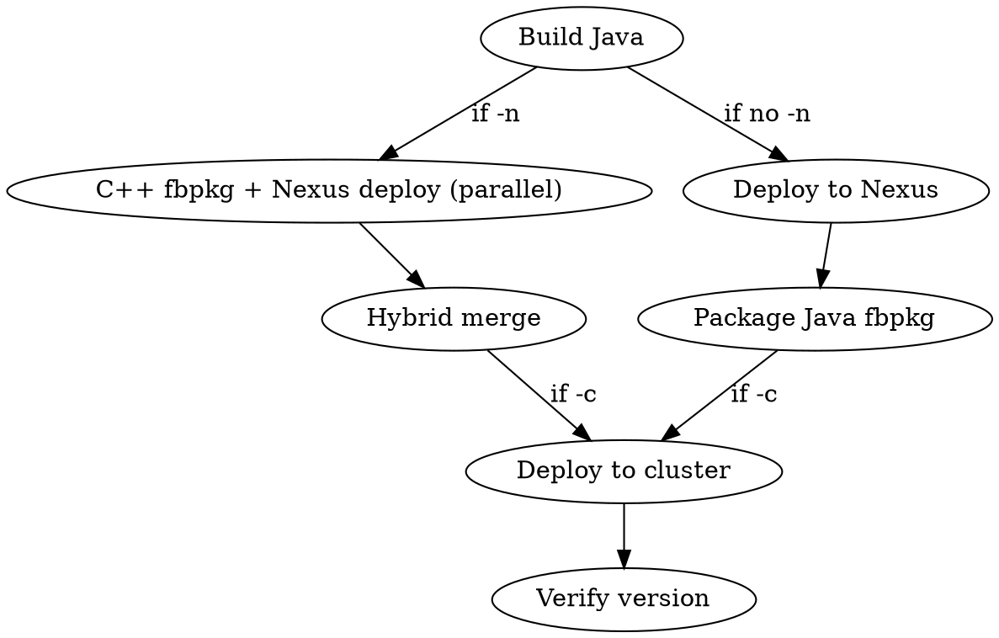

# Presto Deploy

## CRITICAL: Test Clusters Only

**You must NEVER deploy to production clusters.** You may only deploy to Katchin test clusters that you have personally reserved. Before every deployment, verify:

1. **The cluster is a test cluster.** Test cluster names contain `test`, `verifier`, or `katchin` (e.g., `dkl1_batchtest_bgm_3`, `atn1_verifier_t6_2`). If a cluster name does not clearly indicate it is a test cluster, **stop and ask the user to confirm**.
2. **You have an active reservation.** Run `pt pcm test-cluster list` and confirm the target cluster shows your reservation. If it does not, **do not deploy**.
3. **The TW config path is the test config.** When using `tw update`, always use the Katchin test config at `tupperware/config/presto/testing/katchin.tw` — never `tupperware/config/presto/presto.tw` or any other production config.

If there is any ambiguity about whether a cluster is a test cluster, **do not deploy**. Ask the user.

## Overview

Handles the full Nexus deploy, fbpkg packaging, and cluster deployment pipeline.

**Prerequisites:** `feature install warehouse`, Nexus credentials in `~/.m2/settings.xml`

**Key script:** `~/.claude/skills/presto-deploy/presto-deploy`

**Depends on:** `~/.claude/skills/presto-build/presto-build` (sourced for Maven config and build functions)

**Related skills:**
- `presto-build` — Local builds, unit tests, and checkstyle
- `presto-e2e-test` — End-to-end testing against remote clusters (correctness verification, performance regression)

## CRITICAL: Prefer Existing fbpkgs Over Building from Source

**Always check for existing fbpkg versions before building from source.** Building a hybrid package from source takes 3+ hours (C++ opt compilation alone is ~3 hours). In most cases, a suitable package already exists.

**Decision tree:**

1. **No code changes to test?** → Use `pt pcm deploy -pv <version>` with an existing release version. This deploys in minutes.
2. **Java-only changes?** → Build Java, reuse existing C++ fbpkg. Use `presto-deploy` (Java only, no `-n`).
3. **C++ changes?** → Must build C++. Use `presto-deploy -n`. This is the only case that requires a full ~3-hour build.

### Finding Existing Packages

The `presto.presto` fbpkg has two variants: **Java-only** (~3.5 GB) and **hybrid** (~5-7 GB, containing both Java coordinator and C++ `presto_server` binary). Only hybrids work for Prestissimo clusters.

**How `pt pcm deploy -pv` works for Prestissimo clusters:**

For Prestissimo (native) clusters, the TW config (`batch_test.tw`) ignores the `-pv` version for worker packages and instead resolves the C++ hybrid from the `cpp-prod` tag (`presto.presto:cpp-prod`). The `-pv` version only affects the Java coordinator. This means **for config-toggle A/B tests (same binary, different config), just use `pt pcm deploy -pv <any_release_version>`** — the C++ worker binary comes from `cpp-prod` regardless.

```bash
# Check what cpp-prod currently points to
fbpkg info presto.presto:cpp-prod
# → Shows the current production hybrid (typically a bolt build)

# Deploy to a Prestissimo test cluster — workers get cpp-prod automatically
pt pcm deploy -c <cluster> -pv 0.297-edge11 -r "<reason>" -f -ni -dt 0
```

**When you need a specific C++ binary** (e.g., testing C++ code changes, or explicitly needing an opt build), you must build a hybrid from source or find an existing hybrid ephemeral:

```bash
# List recent hybrid ephemerals (contain both Java + C++ binary)
# Hybrids have "presto.presto_cpp-<hash>" in their tags
fbpkg versions presto.presto 2>&1 | grep "presto.presto_cpp-" | head -10

# IMPORTANT: These are built by individual engineers from arbitrary revisions.
# To verify provenance, check the VCS info:
fbpkg info presto.presto:<hash> 2>&1 | grep -E "(Build User|Revision|Upstream)"
# Trunk builds have Revision == Upstream and Build User == twsvcscm (CI) or a known release engineer

# Distinguish opt vs bolt hybrids by version tag:
#   ".cpp-bolt-" in tag  →  bolt (BOLT PGO, avoid for A/B)
#   ".cpp-<user>-" in tag  →  opt (no PGO)

# CI-built packages (fbcode-revision-*) are Java-only, NOT hybrids
```

**fbpkg package naming:**

| Package | Contents | Size | Use case |
|---------|----------|------|----------|
| `presto.presto` (Java-only) | Java coordinator only | ~3.5 GB | Tagged `prod`, `stable`, `fbcode-ci-latest` |
| `presto.presto` (hybrid) | Java coordinator + C++ worker | ~5-7 GB | Tagged `cpp-prod`, or `.cpp-<user>-`/`.cpp-bolt-` version tags |
| `presto.presto_cpp` | C++ opt worker only | ~4.7 GB | Intermediate artifact; many ephemerals built daily |
| `presto.presto_cpp_bolt` | C++ BOLT worker only | ~3.1 GB | Production-optimized intermediate |

## Workflow

When building from source (only when existing packages won't work):



When `-n` (hybrid) is specified with a Java build, the script automatically parallelizes the C++ fbpkg build (~3 hours) with the Nexus deploy + Java fbpkg packaging (~10 minutes). No manual intervention needed.

## Quick Reference

| Task | Command |
|------|---------|
| **Deploy existing release** | **`pt pcm deploy -c <cluster> -pv <version> -r "<reason>" -f -ni -dt 0`** |
| Full build + deploy + fbpkg | `presto-deploy` |
| Skip OSS rebuild | `presto-deploy -T` |
| Hybrid (Java + C++ opt) | `presto-deploy -n` |
| Hybrid with BOLT | `presto-deploy -n -m bolt` |
| Reuse existing Java fbpkg | `presto-deploy -J <hash>` |
| Hybrid with existing Java | `presto-deploy -J <hash> -n` |
| Build + deploy + push to cluster | `presto-deploy -c <cluster> -r "reason"` |
| Full hybrid + push to cluster | `presto-deploy -n -c <cluster> -r "reason"` |

## Nexus Deployment

The script runs `mvn deploy` on `presto-facebook-trunk` and extracts the deployed version from the upload log. The deploy log is written to `/tmp/presto_dev_deploy.log`.

The deployed version string (e.g., `0.297-20260212.123456-31`) is used to create the fbpkg.

## fbpkg Packaging

### Java fbpkg

After Nexus deployment, the script runs `pt build fbpkg presto <version>` to create a `presto.presto:<hash>` fbpkg. The hash is printed and used for cluster deployment.

### C++ fbpkg

When `-n` is specified, the script builds a C++ fbpkg via `fbpkg build fbcode//fb_presto_cpp:<target>`.

| Mode | fbpkg target | Notes |
|------|-------------|-------|
| opt | `presto.presto_cpp` | Default for packaging |
| bolt | `presto.presto_cpp_bolt` | BOLT optimization (requires ThinLTO) |
| asan | `presto.presto_cpp_asan` | Address sanitizer |
| tsan | `presto.presto_cpp_tsan` | Thread sanitizer |
| dbgo | `presto.presto_cpp_dbgo` | Debug optimized |

`dev` mode cannot be packaged — use `presto-build -n` for local C++ dev builds.

### Hybrid merge

When both Java and C++ fbpkgs are produced, the script delegates to `fb_presto_cpp/scripts/build.sh` which merges them into a single `presto.presto` package containing the Java coordinator and C++ worker binary.

## Cluster Reservation

A test cluster must be reserved before deploying to it.

**`pt pcm test-cluster`** — the current tool:

```bash
# List available test clusters
pt pcm test-cluster list
pt pcm test-cluster list --available-only
pt pcm test-cluster list -r <region> -m <machine_type>

# Reserve a test cluster (defaults: 3 hours, 50 workers)
pt pcm test-cluster reserve --request-reason "<reason>"

# Reserve with specific duration, worker count, region, machine type
pt pcm test-cluster reserve -d "2 days" -w 10 -r <region> -m <machine_type> \
    --request-reason "<reason>"

# Reserve a specific cluster
pt pcm test-cluster reserve -c <cluster_name> -d "48 hours" --request-reason "<reason>"

# Extend a reservation
pt pcm test-cluster extend -c <cluster_name> -a "12 hours" --request-reason "<reason>"

# Release a reservation
pt pcm test-cluster release -c <cluster_name>
```

Machine types: `T1`, `T10`, `T6`, `T6F`, `T1_BGM`, `T10_SPR`, `T2`, `T2_TRN`.
Categories: `Warehouse Batch`, `Warehouse Batch Testing`.

**`pt reservation list`** — older tool, still useful for listing clusters filtered by service type:

```bash
pt reservation list
pt reservation list --reserved
pt reservation list --service PRESTISSIMO
```

`pt reservation reserve` and `release` are deprecated — use `pt pcm test-cluster` instead.

### Cluster Sizing

**Production batch clusters typically run 300 workers** (T1_BGM) or 150 workers (T2_TRN). Several Presto configuration parameters are derived from or scale with worker count, so running tests on a significantly smaller cluster produces different behavior. The default reservation is 50 workers — this is sufficient for correctness testing but **not for performance testing**.

**Worker-count-dependent configurations:**

| Config | How it scales | Impact of mismatch |
|--------|---------------|-------------------|
| `query.initial-hash-partitions` | `get_hash_partitions(worker_count, driver_count)`, capped at 333 | Fewer workers → fewer partitions → larger partitions → different shuffle/join behavior |
| `sink.max-buffer-size` | `ceil(0.64 * hash_partitions)` MB | Scales with hash partitions |
| Effective total query memory | `query.max-memory-per-node * worker_count` | 10 workers × 14GB = 140GB vs 300 workers × 14GB = 4.2TB — queries that fit in production may OOM or spill heavily on small clusters |
| `minimum_required_workers_active` | `worker_count * 0.75` | Small clusters start faster |
| Total cluster parallelism | `worker_count * task_threads` | 10 BGM workers = 1,700 threads vs 300 = 51,000 |

**Fixed configurations** (do NOT scale with worker count): `join-max-broadcast-table-size` (1GB), per-worker memory limits, per-worker spill limits (300GB), task thread counts.

**Sizing recommendations:**

| Test purpose | Recommended workers (`-w`) | Why |
|---|---|---|
| Correctness (BEEST, verifier) | 10-50 | Plan shapes may differ but correctness should hold |
| Performance A/B (goshadow/perfrun) | 100-300 | Need production-like hash partitions, memory, and parallelism for representative signal |
| Quick smoke test | 10 | Just checking it runs |

For A/B comparisons, what matters most is that both arms use the **same** cluster size — relative comparisons are valid even on a smaller cluster. But use at least 100 workers on BGM if you want results that generalize to production.

### Build Type for Performance Testing

For A/B performance comparisons, use `opt` (default), **not `bolt`**. BOLT's profile-guided optimization (PGO) is trained on production code paths, so it disproportionately optimizes whichever behavior is dominant in production. If you're testing whether a code path change (e.g., disabling TLS, changing a shuffle algorithm) improves performance, BOLT will have already optimized the *current* path — biasing results toward the control arm and underestimating the treatment's benefit.

Prestissimo's build modes and their PGO characteristics:

| Mode | Optimization | LTO | BOLT PGO | FDO | Fair for A/B? |
|---|---|---|---|---|---|
| `@mode/opt` | -O3 | No | No | No | **Yes** |
| `@mode/opt-clang-thinlto` | -O3 | ThinLTO | **Yes** (trained on prod) | No | No |
| `bolt` fbpkg mode | -O3 | ThinLTO | **Yes** | No | No |

`@mode/opt` is the clean optimized mode — no profile-guided optimizations of any kind. The default AutoFDO profile was removed from fbcode in August 2024, Prestissimo is not registered in the centralized AutoFDO refresh pipeline, and BOLT only activates under LTO modes. The `presto.presto_cpp` fbpkg is built with `@mode/opt`, so it's PGO-free.

**Important nuance for config-toggle A/B tests** (e.g., HTTPS on/off, session property change): Even though both arms use the identical binary, PGO (BOLT) bias does NOT cancel out if the config toggle changes which code paths are hot. BOLT optimizes instruction layout for production code paths. If the toggle changes which paths are exercised (e.g., disabling HTTPS removes TLS encryption from the hot path), BOLT unfairly optimizes the production-config arm. **Always use opt builds for any A/B experiment, including config-toggle tests.**

**Getting an opt hybrid for deployment:**

The `presto.presto_cpp` fbpkg builder has `fbpkg_ci_schedules = [ci.continuous]`, keeping the opt C++ build warm in RE cache. To produce a deployable opt hybrid:

```bash
# 1. Build opt C++ (instant if CI cache is warm)
fbpkg build fbcode//fb_presto_cpp:presto.presto_cpp
# → prints hash like "presto.presto_cpp:<hash>"

# 2. Merge with Java coordinator to create deployable hybrid (~5 min)
~/fbsource/fbcode/fb_presto_cpp/scripts/build.sh <hash>
# → prints hybrid hash like "presto.presto:<hybrid_hash>"

# 3. Deploy the opt hybrid
pt pcm deploy -c <cluster> -pv <hybrid_version> -r "opt build" -f -ni -dt 0
```

Note: `fbpkg build` rejects untracked files. Move `etc-local/` dirs out of the repo first, restore after.

```bash
# Config-toggle A/B — still use opt, not bolt. BOLT optimizes for production
# code paths, which biases results when the toggle changes hot paths.
# Use an existing opt hybrid ephemeral (both arms get the same binary):
fbpkg versions presto.presto 2>&1 | grep -v "cpp-bolt" | grep "cpp-" | head -10
# Pick one, then deploy with: pt pcm deploy -c <cluster> -pv <opt-version> ...

# Binary-comparison A/B (different code) — must use opt, not bolt
presto-deploy -n -c <cluster> -r "Performance A/B arm"

# BOLT — only for production-representative performance profiling (NOT A/B tests)
presto-deploy -n -m bolt -c <cluster> -r "Production-representative perf"
```

### Region Selection

Cluster region matters for two reasons:

1. **BEEST synthetic data availability:** BEEST synthetic data is replicated to local namespaces across regions, but not all suites have data everywhere. Prefer common regions (`atn`, `ftw`, `pnb`, `rcd`) where data is most likely present. Less common regions (`dkl`, `maz`, `mwg`, `ncg`) may be missing data for some suites.

2. **Cross-region reads:** Batch test clusters have `allowed_fb_regions` restricted to their local region (set in `batch_native.cinc` line 647). This means queries cannot access data in other regions — they'll fail with `PRISM_REGION_NOT_ALLOWED`. Katchin verifier clusters allow all regions by default (`allowed_fb_regions = "*"` via `utils.cinc` line 958).

### Reservation Checklist

Before reserving, determine:

| Consideration | Flag | Guidance |
|---|---|---|
| **Worker count** | `-w` | 10 for correctness, 100-300 for perf |
| **Region** | `-r` | Prefer `atn`, `ftw`, `pnb`, `rcd` for BEEST; match production region for goshadow |
| **Machine type** | `-m` | `T1_BGM` for standard batch (most common production type) |
| **Duration** | `-d` | Correctness: 2-3h. Perf A/B: 6-8h (deploy + control run + experiment run). |
| **Category** | `--category` | `"Warehouse Batch Testing"` for Prestissimo batch clusters |

```bash
# Typical performance testing reservation
pt pcm test-cluster reserve -w 300 -r rcd -m T1_BGM -d "8 hours" \
    --request-reason "Performance A/B: <description>"

# Typical correctness testing reservation
pt pcm test-cluster reserve -w 10 --request-reason "BEEST correctness: <description>"
```

### Modifying Cluster Config for Testing

Some tests require cluster-wide config changes that cannot be set via session properties (e.g., `internal-communication.https.required`, `allowed_fb_regions`). This section explains the config architecture and how to make these changes.

#### Which TW Config File Manages Your Cluster?

**This is critical.** Modifying the wrong file will silently have no effect — your config change won't be applied but everything will appear to work. The experiment will run with both arms having identical config.

| Cluster type | How you got it | TW config file | Override approach |
|---|---|---|---|
| **Statically-defined Katchin** (`atn6_prestotest2`, `ftw2_prestotest_ec1`, `atn1crossenginetest1`) | Hardcoded in `katchin.tw` | `testing/katchin.tw` | Post-construction override on `cluster_job_configs` dict (see below) |
| **Dynamically-reserved batch test** (`pnb1_batchtest_bgm_2`, `rcd1_batchtest_bgm_1`, etc.) | `pt pcm test-cluster reserve` | `testing/batch_test.tw` | Must modify the `.cinc` helper that generates configs (see below) |

**How to verify which file manages your cluster:** Check the deploy log output. `pt pcm deploy` prints `Creating NUJ for ... from spec file at .../config/presto/testing/<file>.tw`. If it says `batch_test.tw`, do NOT put overrides in `katchin.tw`.

#### Tupperware Config Architecture

Presto cluster config is generated by Python code in `tupperware/config/presto/`. The generation flow:

1. A `.tw` file (e.g., `testing/katchin.tw`) defines clusters and calls `WarehouseBatchConfig(...)` constructors
2. The constructor (in `presto.cinc`) calls helper methods like `enable_https()`, sets ports, exchange settings, etc.
3. Post-construction overrides are applied via dict-style access on the config object
4. The TW spec is compiled into the final deployment config

**Key config files:**

| File | Role |
|------|------|
| `testing/katchin.tw` | Statically-defined Katchin test clusters only (`atn6_prestotest2`, etc.); supports direct post-construction overrides |
| `testing/batch_test.tw` | All dynamically-reserved batch test clusters (from `pt pcm test-cluster reserve`); delegates to helper `.cinc` files |
| `include/tupperware_configs/warehouse/batch_native.cinc` | Generates Prestissimo batch cluster configs; modify here for dynamically-reserved Prestissimo clusters |
| `include/tupperware_configs/warehouse/batch.cinc` | Generates Java batch cluster configs |
| `include/configgen.cinc` | Core config generation helpers (`enable_https()`, `enable_auth()`, etc.) |
| `include/presto.cinc` | `WarehouseConfig` / `WarehouseBatchConfig` classes — assembles all config |
| `include/warehouse_config.cinc` | Shared/coordinator/worker `config.properties` defaults (ports, exchange, memory) |

All paths relative to `tupperware/config/presto/`.

#### Override Approaches

##### For statically-defined Katchin clusters (katchin.tw)

`katchin.tw` builds config objects into a `cluster_job_configs` dict, which supports direct post-construction overrides:

**Approach 1: Constructor-level override.** Modify the parameter passed to the config constructor. This changes config at generation time but may trigger validation constraints:

```python
# In katchin.tw, before config construction:
secure_internal_communications[cluster] = False    # disables internal HTTPS
hipster_acl_name[cluster] = None                   # must also clear this (see constraints below)
```

**Approach 2: Post-construction property override.** Override individual `config.properties` entries after the config object is built. This bypasses validation and is useful for changing one property while keeping everything else intact:

```python
# In katchin.tw, after the config construction loop (after ~line 261):
if cluster == "<your_cluster>":
    for ptype in ["coordinator", "worker", "resource_manager"]:
        cluster_job_configs[cluster].config_files[ptype]["config.properties"]["internal-communication.https.required"] = "false"
```

This is the same pattern already used in `katchin.tw` for catalog and other per-cluster overrides.

##### For dynamically-reserved batch test clusters (batch_test.tw)

`batch_test.tw` does NOT have a `cluster_job_configs` dict. It delegates config generation to `batch.get_warehouse_batch_jobs()` and `batch_native.get_warehouse_batch_native_jobs()`. **Config is frozen via `freeze_config_files()` and serialized into a `CONFIG_BLOB` env variable before the jobs are returned.** You cannot modify config on the returned Job objects — it will silently have no effect.

**Approach: Modify `batch_native.cinc` before the freeze.** For Prestissimo clusters, edit `include/bootstrap_configs/warehouse/batch_native.cinc`. Add a cluster-specific override inside `get_native_batch_bootstrap_configs()`, **before** the `freeze_config_files()` call (~line 776), after the existing per-cluster overrides (e.g., the `nha1_batch_bgm_4` block at ~line 767):

```python
    # Example: disable HTTPS for a specific test cluster
    if cluster_name == "<your_cluster>":
        for ptype in ["coordinator", "worker"]:
            bootstrap_configs.config_files[ptype]["config.properties"].update(
                {"internal-communication.https.required": "false"}
            )
```

For Java clusters, the equivalent file is `include/tupperware_configs/warehouse/batch.cinc`.

#### How `pt pcm deploy -l` Works

The `-l` / `--use-local-config` flag deploys the **entire TW config from your local working copy** (`~/fbsource/fbcode/tupperware/`). Any uncommitted changes to `.tw` or `.cinc` files take effect. Without `-l`, the tool uses a daily-published config snapshot (`tupperware_fbcode_config_snapshot:daily`), so local changes won't be picked up.

**CRITICAL: Do not combine `-l` with `-pv`.** The local spec compiles a CONFIG_BLOB that embeds a Presto version. If `-pv` specifies a different version, the CONFIG_BLOB will be compiled for one version while the binary is another. This mismatch crashes workers on startup and leaves the cluster unrecoverable without manual `tw restart` (which Claude Code cannot do). When using `-l`, omit `-pv` entirely — the local spec controls the version.

#### Workflow

1. **Modify the TW config file** using one of the approaches above.
2. **Validate:** `tw.real validate ~/fbsource/fbcode/tupperware/config/presto/testing/<your_tw_file>.tw` (use the `.tw` file that manages your cluster — see "Which TW Config File Manages Your Cluster?" above). If you modified a `.cinc` file, validate the `.tw` file that imports it.
3. **Deploy with local config:** `pt pcm deploy -c <cluster> -l -r "<reason>" -f -ni -dt 0`
   - **Do NOT pass `-pv`** — see "CRITICAL: Never use `-pv` with `-l`" above.
   - For Claude Code: follow the "Claude Code Deployment" pattern — run in background, then `tw.real task-control apply-task-ops`.
4. **Verify the change took effect** (see below).
5. **Always revert the config change when done.**

#### Verifying Config Changes at Runtime

After deploying a config change, verify it took effect before running tests:

```bash
# Check a specific config property via the Presto info endpoint or logs
presto-test cli -c <cluster> -e "SELECT 1"   # basic connectivity

# For HTTPS toggle: run a multi-stage query and check coordinator logs
# for exchange location URIs — http://worker:7777 vs https://worker:7778
```

#### Common Config Properties Reference

| What | TW Parameter | Presto Property | Where Set |
|------|-------------|-----------------|-----------|
| Internal HTTPS | `secure_internal_communications` | `internal-communication.https.required` | `configgen.cinc` `enable_https()` |
| Cross-region access | `allowed_fb_regions` | `namespace.allowed-fb-regions` (catalog) | `batch_native.cinc` |
| HTTP port | (always set) | `http-server.http.port` = 7777 | `warehouse_config.cinc` |
| HTTPS port | (set when HTTPS enabled) | `http-server.https.port` = 7778 | `configgen.cinc` |
| Hipster ACL | `hipster_acl_name` | `http-server.authorization.enabled` | `configgen.cinc` |

#### Validation Constraints

`secure_internal_communications=False` is incompatible with `hipster_acl_name` being set — `enable_https()` raises `ValueError` if both are specified (`configgen.cinc:204-215`). Use Approach 2 (post-construction override) to bypass this when you need to disable internal HTTPS while keeping Hipster ACL config intact.

#### Network Ports

Workers always listen on **both** HTTP (7777) and HTTPS (7778) in production (`disable_http` defaults to `False`). Setting `internal-communication.https.required=false` only changes which URI scheme/port the coordinator advertises for internal communication — it does not disable the HTTPS listener. This means you can safely toggle the property without worrying about connection failures.

## Deploying to a Test Cluster

Always deploy as fast as possible. Test clusters have no real traffic, so there is no reason for gradual rollouts, drain timeouts, or canary checks.

### Claude Code Deployment (AI Agent Constraints)

Claude Code cannot run `tw update` or `tw restart` — these are blocked by AI agent policy (server-side TW API rejection). Additionally, the `tw` wrapper binary is blocked by bpfjailer, but `tw.real` bypasses this. Use `tw.real` for all TW CLI commands.

**The only mutation path available to Claude Code is `pt pcm deploy`.** Without intervention, `pt pcm deploy` does a slow incremental rollout (~30 min for 200 workers). To speed this up, immediately run `tw.real task-control apply-task-ops` after the deploy enters the `waiting_for_tw_jobs_updated` state. This forces all tasks to restart simultaneously, bringing total deploy time to ~5 minutes.

**Standard deploy (no config changes):**

```bash
# 1. Deploy in background
pt pcm deploy -c <cluster> -pv <version> -r "<reason>" -f -ni -dt 0 &

# 2. Wait ~2 min for deploy to push the update to TW
sleep 120

# 3. Force immediate restart of all tasks
tw.real task-control apply-task-ops --all-ops --silent tsp_<region>/presto/<cluster>.worker
tw.real task-control apply-task-ops --all-ops --silent tsp_<region>/presto/<cluster>.coordinator

# 4. Wait ~1-2 min for tasks to start, then verify
presto --smc <cluster> --oncall presto_release_internal \
    --execute "SELECT node_version, coordinator, count(*) FROM system.runtime.nodes GROUP BY 1, 2"
```

**Config-change deploy (with `-l`):**

Same as above, but with `-l` flag and **no `-pv` flag**. See the warning below about why `-pv` must not be used with `-l`.

```bash
pt pcm deploy -c <cluster> -l -r "<reason>" -f -ni -dt 0 &
sleep 120
tw.real task-control apply-task-ops --all-ops --silent tsp_<region>/presto/<cluster>.worker
tw.real task-control apply-task-ops --all-ops --silent tsp_<region>/presto/<cluster>.coordinator
```

**If a deploy gets stuck or fails**, cancel the stale PCM request before issuing a new one:

```bash
# The request ID is printed in the deploy output
pt pcm cancel --request_id <request_id>
```

Stale PCM requests block subsequent deploys to the same cluster. Always cancel before retrying.

**CRITICAL: Never use `-pv` with `-l`.** The `-l` flag compiles the TW spec from your local working copy. The spec embeds a Presto version in the CONFIG_BLOB (which contains `config.properties`). The `-pv` flag overrides the *deployed binary version* but NOT the CONFIG_BLOB. If the local spec's version differs from `-pv`, the CONFIG_BLOB will be compiled for one version while the binary is another — this mismatch will crash workers on startup and leave the cluster in a broken state that requires manual `tw restart` to recover (which Claude Code cannot do). When using `-l`, let the local spec control the version entirely. Both arms of a config-toggle A/B will get the same version from the same local spec, which is what you want.

### Recommended (human operator): `tw update` + `apply-task-ops`

This is the fastest deployment method but requires TW mutation permissions (not available to AI agents). It pushes the update and immediately forces all tasks to restart simultaneously:

```bash
# 1. Verify this is a test cluster you have reserved
pt pcm test-cluster list | grep <cluster_name>

# 2. Push the update (uses the TESTING config — never use presto.tw)
PRESTO_VERSION=<version> tw update \
  ~/fbsource/fbcode/tupperware/config/presto/testing/katchin.tw \
  '.*<cluster_name>.*(coordinator|worker|resource_manager)' --force

# 3. Immediately force all tasks to restart (bypasses slow incremental rollout)
tw task-control apply-task-ops --all-ops --silent tsp_<region>/presto/<cluster_name>.worker
tw task-control apply-task-ops --all-ops --silent tsp_<region>/presto/<cluster_name>.coordinator
tw task-control apply-task-ops --all-ops --silent tsp_<region>/presto/<cluster_name>.resource_manager

# 4. Verify deployment (use node_version for Prestissimo — version() doesn't exist)
presto --smc <cluster_name> --oncall <oncall> --execute "SELECT node_version FROM system.runtime.nodes LIMIT 1"
```

Without step 3, TW rolls out incrementally (e.g., 10% of tasks at a time with cooldown periods), which can take 30+ minutes for no benefit on a test cluster.

`tw task-control show-task-ops <job_handle>` shows pending operations if you want to inspect before applying.

Note: `tw update --fast` is **deprecated** under Spec 2.0. The `apply-task-ops` pattern above is its replacement.

### Restart without version change

When you only need to restart tasks (e.g., after a config-only change):

```bash
tw restart --fast --kill tsp_<region>/presto/<cluster_name>.worker
```

- `--fast` — restart all tasks simultaneously
- `--kill` — SIGKILL, skip graceful shutdown (no real traffic to drain on test clusters)

Note: Claude Code cannot run `tw restart` (AI agent policy). If a cluster needs a restart and Claude Code broke it, ask the user to run the command above.

### Verify deployment

```bash
# Java Presto clusters
presto --smc <cluster_name> --execute "SELECT version()"

# Prestissimo clusters (version() function does not exist)
presto --smc <cluster_name> --oncall <oncall> --execute "SELECT node_version FROM system.runtime.nodes LIMIT 1"
```

Note: batch clusters require `--oncall <oncall_name>` (e.g., `--oncall presto_release_internal`).

If the cluster is still restarting, this will fail with connection refused. Check task status with:

```bash
tw.real job show tsp_<region>/presto/<cluster_name>.worker
```

## Common Issues

| Problem | Fix |
|---------|-----|
| `mvn deploy` fails with auth error | Check Nexus credentials: `cat ~/.m2/settings.xml` |
| fbpkg build fails | Ensure `mvn deploy` succeeded; check `/tmp/presto_dev_deploy.log` |
| `fbpkg build` refuses to run (dirty repo) | `fbpkg build` rejects untracked files. Move `etc-local/` dirs out of repo before building, restore after. |
| C++ fbpkg hash empty | Check `fbpkg build fbcode//fb_presto_cpp:<target>` output directly |
| Cluster shows old version after deploy | Run `tw.real task-control apply-task-ops --all-ops` on each job handle to force restart |
| `presto --smc` connection refused | Cluster may still be restarting; check `tw.real job show tsp_<region>/presto/<cluster>.worker` |
| Deploy seems stuck / rolling slowly | Run `tw.real task-control apply-task-ops --all-ops --silent` on worker and coordinator job handles |
| `pt pcm deploy` stuck in QUEUED | A previous deploy request may be blocking. Cancel it with `pt pcm cancel --request_id <id>` (request ID is in the deploy output) |
| `tw` command blocked by bpfjailer | Use `tw.real` instead — the wrapper `tw` is blocked but the actual binary `tw.real` is not |
| `tw.real update` / `tw.real restart` fails with "AI agents forbidden by policy" | TW mutations are blocked for AI agents. Use `pt pcm deploy` instead. For restarts, ask the user to run `tw restart --fast --kill` manually |
| Workers crash after `pt pcm deploy -l -pv` | Version mismatch: `-pv` overrides the binary but not the CONFIG_BLOB. Never combine `-l` with `-pv`. Cancel the request, revert config, and redeploy without `-l` to restore the cluster. Then ask the user to run `tw restart --fast --kill` if tasks are stuck |
