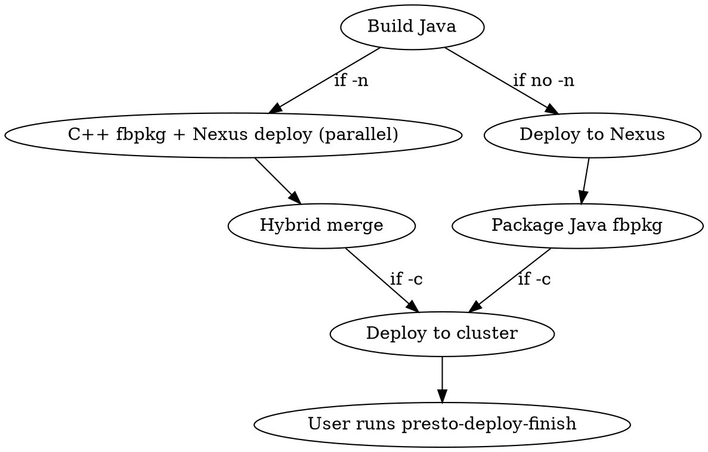

# Presto Deploy

## CRITICAL: Test Clusters Only

**You must NEVER deploy to production clusters.** You may only deploy to Katchin test clusters that you have personally reserved. Before every deployment, verify:

1. **The cluster is a test cluster.** Test cluster names contain `test`, `verifier`, or `katchin` (e.g., `dkl1_batchtest_bgm_3`, `atn1_verifier_t6_2`). If a cluster name does not clearly indicate it is a test cluster, **stop and ask the user to confirm**.
2. **You have an active reservation.** `pt pcm test-cluster list` is blocked for Claude Code (SAP), so confirm the reservation from the user's `pt pcm test-cluster reserve` output (it prints `Reserved By` and `Expires At`). Note: PCM-reserved batch clusters do **not** appear in the older `pt reservation list` — its absence there is not evidence it's unreserved. `pt pcm deploy` itself also gates on your reservation.
3. **The TW config path is the test config.** When using `tw update`, always use the Katchin test config at `tupperware/config/presto/testing/katchin.tw` -- never `tupperware/config/presto/presto.tw` or any other production config.

If there is any ambiguity about whether a cluster is a test cluster, **do not deploy**. Ask the user.

## Overview

Handles the full Nexus deploy, fbpkg packaging, and cluster deployment pipeline.

**Prerequisites:** `feature install warehouse`, Nexus credentials in `~/.m2/settings.xml`

**Key scripts:**
- `~/.claude/skills/presto-deploy/presto-deploy` -- builds, packages, deploys (everything Claude Code can do)
- `~/.claude/skills/presto-deploy/presto-deploy-finish` -- completes SAP-blocked steps (user runs this)

**Depends on:** `~/.claude/skills/presto-build/presto-build` (sourced for Maven config and build functions)

**Related skills:**
- `presto-build` -- Local builds, unit tests, and checkstyle
- `presto-e2e-test` -- End-to-end testing against remote clusters (correctness verification, performance regression)

## SAP Policy — what Claude Code can and cannot run

All Presto test/verifier TW specs have an `allowAgents` policy (D99740807) granting Claude Code `MUTATE`/`CONTROL` on the **Tupperware** API (`tw` commands) for test/verifier tiers. **But the `pt pcm` family and `fbpkg tag` are blocked** by a separate SAP policy on `CPPlatformApiServer.executeAction` / fbpkg.

**What Claude Code CAN do:** `tw update`, `tw task-control apply-task-ops`, `tw restart`, `tw job status`, `tw log`, `fbpkg build`, `fbpkg fetch`, `fbpkg info`, `fbpkg versions`, `presto --smc`, `mvn deploy`, and the `fb_presto_cpp/scripts/build.sh` hybrid merge (the merge's `fbpkg build` succeeds; only its trailing `fbpkg tag` is blocked).

**What the USER must run (blocked for Claude Code — `CPPlatformApiServer.executeAction` SAP block):** ALL `pt pcm ...` commands, including `pt pcm test-cluster list/reserve/release`, **`pt pcm deploy`**, and `pt pcm cancel`. Hand the user the exact command to run via `!` and have them paste the output. *(Verified 2026-06-12: `pt pcm deploy` fails for the agent with `[Service Authorization Platform] ... blocked method 'CPPlatformApiServer.executeAction'`.)*

**What the user MUST do via `presto-deploy-finish`:**
- `fbpkg tag` -- tag the hybrid package (only needed when you deploy by `v<version>` tag rather than by hash; deploying by `-pv <hash>` needs no tag)

**Deploy without `pt pcm` (fully agent-runnable alternative):** the `tw update` + `apply-task-ops` fast path below works for Claude Code on test/verifier tiers. It needs the package resolvable by the TW config (tag `v<version>`), so it pairs with a user-run `fbpkg tag`. When in doubt, the simplest division of labor is: agent builds the (hybrid) fbpkg → user runs `pt pcm deploy -pv <hash>` → agent runs `presto-deploy-finish accelerate` and verifies with `presto --smc`.

## CRITICAL: Prefer Existing fbpkgs Over Building from Source

**Always check for existing fbpkg versions before building from source.** Building a hybrid package from source takes 3+ hours (C++ opt compilation alone is ~3 hours). In most cases, a suitable package already exists.

**FIRST decide: is the target cluster Prestissimo (C++ workers) or all-Java?** This determines the package type, and getting it wrong crash-loops the cluster (see "CRITICAL: Match the package to the cluster type" below). Batch (`*_batch*`, `*_bgm_*`) and verifier clusters are almost always **Prestissimo**.

**Decision tree for a Prestissimo cluster (the common case):**

1. **No code changes to test?** Use `pt pcm deploy -pv <version>` with an existing **hybrid** version (e.g. resolve `cpp-prod`). Deploys in minutes.
2. **Java-only (coordinator) change?** You STILL need a hybrid. Build Java, then **merge it with an existing C++ fbpkg** (`presto.presto_cpp`) into a hybrid and deploy the hybrid. Use `presto-deploy -J <java_hash> -n` (or `presto-deploy -n`). **Do NOT deploy a Java-only package to a Prestissimo cluster — it has no C++ `presto_server` binary, so every worker crash-loops and the cluster goes down.**
3. **C++ change?** Build C++ + merge hybrid. Use `presto-deploy -n` (full ~3-hour build only if the opt C++ cache is cold).

**Decision tree for an all-Java cluster** (Java workers, no Prestissimo): deploy the **Java-only** `presto.presto` package — `presto-deploy` without `-n`. A hybrid is unnecessary here.

### CRITICAL: Match the package to the cluster type

`pt pcm deploy -pv <version>` (and the `tw update`/`PRESTO_VERSION` paths) set the `presto.presto` package version for **both the coordinator and the workers**. The package at that version must contain the binary each role needs:

| Cluster type | Worker binary needed | Package you must deploy | Deploying the wrong one |
|---|---|---|---|
| **Prestissimo** (C++ workers) | C++ `presto_server` | **Hybrid** `presto.presto` (Java coord + C++ worker, ~5–7 GB) | Java-only package → workers find no C++ binary → **crash-loop, cluster down** |
| **All-Java** | Java | **Java-only** `presto.presto` (~3.5 GB) | Hybrid works but is wasteful |

A coordinator-only Java change on a Prestissimo cluster is the trap: it feels "Java-only", but you must still ship a hybrid so the C++ workers keep a valid binary. Build your Java fbpkg, then merge it with a recent `presto.presto_cpp` (the C++ workers are unchanged) — see "Hybrid merge" and "Getting an opt hybrid for deployment" below.

### Finding Existing Packages

The `presto.presto` fbpkg has two variants: **Java-only** (~3.5 GB) and **hybrid** (~5-7 GB, containing both Java coordinator and C++ `presto_server` binary). **Only hybrids work for Prestissimo clusters.**

**How `pt pcm deploy -pv` resolves the version for Prestissimo clusters:**

`-pv <version>` (or `<hash>`) sets the `presto.presto` package version for **both** the Java coordinator AND the C++ workers. The `cpp-prod` tag is only the *fallback* when no version is specified (resolution order: `PRESTO_VERSION` env → `TW_PUSHED_VERSION` → `cpp-prod` tag — see "How Prestissimo Worker Version Is Resolved" below). So if you pass `-pv <something>`, that `<something>` **must point at a hybrid** — a Java-only package or hash will crash the workers.

> ⚠️ Historical note: an earlier version of this skill claimed `-pv` only affected the coordinator and workers always came from `cpp-prod`. That is **wrong** — verified on 2026-06-12 when `pt pcm deploy -pv <java_only_hash>` crash-looped all 50 workers on a `*_batchtest_bgm_*` cluster.

```bash
# Resolve a known-good hybrid (cpp-prod) and deploy it
fbpkg info presto.presto:cpp-prod          # e.g. -> presto.presto:5928 (a hybrid)
pt pcm deploy -c <cluster> -pv <hybrid_version_or_hash> -r "<reason>" -f -ni -dt 0
```

For config-toggle A/B tests (same binary, different config) you still deploy a **hybrid** version for both arms — the binary is identical, only the config differs.

**When you need a specific C++ binary** (e.g., testing C++ code changes, or explicitly needing an opt build), you must build a hybrid from source or find an existing hybrid ephemeral:

```bash
# List recent hybrid ephemerals (contain both Java + C++ binary)
fbpkg versions presto.presto 2>&1 | grep "presto.presto_cpp-" | head -10

# Verify provenance:
fbpkg info presto.presto:<hash> 2>&1 | grep -E "(Build User|Revision|Upstream)"

# Distinguish opt vs bolt hybrids by version tag:
#   ".cpp-bolt-" in tag  ->  bolt (BOLT PGO, avoid for A/B)
#   ".cpp-<user>-" in tag  ->  opt (no PGO)
```

**fbpkg package naming:**

| Package | Contents | Size | Use case |
|---------|----------|------|----------|
| `presto.presto` (Java-only) | Java coordinator only | ~3.5 GB | Tagged `prod`, `stable`, `fbcode-ci-latest` |
| `presto.presto` (hybrid) | Java coordinator + C++ worker | ~5-7 GB | Tagged `cpp-prod`, or `.cpp-<user>-`/`.cpp-bolt-` version tags |
| `presto.presto_cpp` | C++ opt worker only | ~4.7 GB | Intermediate artifact; many ephemerals built daily |
| `presto.presto_cpp_bolt` | C++ BOLT worker only | ~3.1 GB | Production-optimized intermediate |

## Deploying to a Test Cluster

Always deploy as fast as possible. Test clusters have no real traffic, so there is no reason for gradual rollouts, drain timeouts, or canary checks.

### Claude Code Deployment

Run `presto-deploy`, then paste the `presto-deploy-finish` command for the user to run.

**Step-by-step:**

1. **Verify** the cluster is a test cluster with an active reservation (from the user's reserve output — `pt pcm test-cluster list` is SAP-blocked for the agent). Confirm whether it's **Prestissimo or all-Java** and pick the package type accordingly (see "CRITICAL: Match the package to the cluster type").

2. **Build the right package** (note: the `-c` deploy step inside `presto-deploy` runs `pt pcm deploy`, which is **blocked for the agent** — so build without `-c`, then hand the user the `pt pcm deploy` command):
   ```bash
   # Prestissimo cluster (hybrid REQUIRED — even for coordinator-only Java changes):
   presto-deploy -n                       # build Java + C++ + merge hybrid
   presto-deploy -J <java_hash> -n        # merge existing Java fbpkg with C++ into a hybrid
   # All-Java cluster only:
   presto-deploy                          # Java-only package
   ```
   Then give the user: `pt pcm deploy -c <cluster> -pv <hybrid_or_java_hash> -r "<reason>" -f -ni -dt 0`

3. **Accelerate the rollout** -- the `presto-deploy` script now runs `presto-deploy-finish accelerate` automatically after deployment. For hybrid builds, paste the `presto-deploy-finish tag` command for the user to run (`fbpkg tag` is still blocked).

4. **Verify** the deployment:
   ```bash
   presto --smc <cluster> --oncall presto_release_internal \
       --execute "SELECT node_version, coordinator, count(*) FROM system.runtime.nodes GROUP BY 1, 2"
   ```

### Deploy without building (existing version)

```bash
pt pcm deploy -c <cluster> -pv <version> -r "<reason>" -f -ni -dt 0
```

Then ask the user to run:
```bash
presto-deploy-finish accelerate <cluster>
```

### Deploy with local TW config changes

`-l` is a boolean `--use-local-config` flag — it does **not** take a value. `-pv` is always **required** by the click parser (regardless of `-l`); you cannot omit it. The CLI **overwrites `PRESTO_VERSION` in `os.environ` from the `-pv` value** before evaluating the TW spec (see `deploy.py:_get_maven_version` + the `os.environ[version_env_var] = maven_version` block following it, added in D99880356 on 2026-04-07), so setting `PRESTO_VERSION=...` in your shell is moot and `-l` + `-pv` are safe to combine — the env var stays in sync with the binary by construction.

Use the `-L` flag on `presto-deploy` to deploy with local TW config:

```bash
# Build + deploy with local config (-L forwards the maven version to pt pcm deploy -pv)
presto-deploy -n -L -c <cluster> -r "<reason>"

# Deploy existing fbpkg with local config
presto-deploy -J <hash> -L -c <cluster> -r "<reason>"
```

Or manually via `pt pcm deploy`:
```bash
pt pcm deploy -c <cluster> -pv <maven_version> -l -r "<reason>" -f -ni -dt 0
```

Then accelerate the rollout:
```bash
presto-deploy-finish accelerate <cluster>
```

### Stuck or failed deploys

Cancel the stale PCM request before retrying:
```bash
pt pcm cancel --request_id <request_id>
```

If workers are crash-looping and need a restart:
```bash
presto-deploy-finish restart <cluster>
```

## `presto-deploy-finish` Reference

| Command | What it does |
|---------|-------------|
| `presto-deploy-finish tag <identifier> <version_tag> [<cpp_tag>]` | `fbpkg tag` the hybrid package |
| `presto-deploy-finish accelerate <cluster>` | Poll + `tw task-control apply-task-ops` on worker and coordinator |
| `presto-deploy-finish restart <cluster>` | `tw restart --fast --kill` on workers |

## Quick Reference

| Task | Command |
|------|---------|
| **Deploy existing release** | **`pt pcm deploy -c <cluster> -pv <version> -r "<reason>" -f -ni -dt 0`** |
| Full build + deploy + fbpkg | `presto-deploy` |
| Skip OSS rebuild | `presto-deploy -T` |
| Hybrid (Java + C++ opt) | `presto-deploy -n` |
| Hybrid with BOLT | `presto-deploy -n -m bolt` |
| Reuse existing Java fbpkg | `presto-deploy -J <hash>` |
| Hybrid with existing Java | `presto-deploy -J <hash> -n` |
| Build + deploy + push to cluster | `presto-deploy -c <cluster> -r "reason"` |
| Full hybrid + push to cluster | `presto-deploy -n -c <cluster> -r "reason"` |
| Deploy with local TW config | `presto-deploy -L -c <cluster> -r "reason"` |
| Hybrid + local TW config | `presto-deploy -n -L -c <cluster> -r "reason"` |

## Workflow

When building from source (only when existing packages won't work):


```dot
digraph deploy {
  "Build Java" -> "C++ fbpkg + Nexus deploy (parallel)" [label="if -n"];
  "Build Java" -> "Deploy to Nexus" [label="if no -n"];
  "C++ fbpkg + Nexus deploy (parallel)" -> "Hybrid merge";
  "Deploy to Nexus" -> "Package Java fbpkg";
  "Package Java fbpkg" -> "Deploy to cluster" [label="if -c"];
  "Hybrid merge" -> "Deploy to cluster" [label="if -c"];
  "Deploy to cluster" -> "User runs presto-deploy-finish";
}
```

When `-n` (hybrid) is specified with a Java build, the script automatically parallelizes the C++ fbpkg build (~3 hours) with the Nexus deploy + Java fbpkg packaging (~10 minutes). No manual intervention needed.

## Nexus Deployment

The script runs `mvn deploy` on `presto-facebook-trunk` and extracts the deployed version from the upload log. The deploy log is written to `/tmp/presto_dev_deploy.log`.

The deployed version string (e.g., `0.297-20260212.123456-31`) is used to create the fbpkg.

## fbpkg Packaging

### Java fbpkg

After Nexus deployment, the script runs `pt build fbpkg presto <version>` to create a `presto.presto:<hash>` fbpkg. The hash is printed and used for cluster deployment.

### C++ fbpkg

When `-n` is specified, the script builds a C++ fbpkg via `fbpkg build fbcode//fb_presto_cpp:<target>`.

| Mode | fbpkg target | Notes |
|------|-------------|-------|
| opt | `presto.presto_cpp` | Default for packaging |
| bolt | `presto.presto_cpp_bolt` | BOLT optimization (requires ThinLTO) |
| asan | `presto.presto_cpp_asan` | Address sanitizer |
| tsan | `presto.presto_cpp_tsan` | Thread sanitizer |
| dbgo | `presto.presto_cpp_dbgo` | Debug optimized |

`dev` mode cannot be packaged -- use `presto-build -n` for local C++ dev builds.

### Hybrid merge

When both Java and C++ fbpkgs are produced, the script delegates to `fb_presto_cpp/scripts/build.sh` which merges them into a single `presto.presto` package containing the Java coordinator and C++ worker binary.

## Cluster Reservation

A test cluster must be reserved before deploying to it.

> **ALWAYS reserve for at least 24 hours -- usually much longer.** The 3-hour
> default is a trap: e2e testing (build + deploy + rollout + control run +
> experiment run + log inspection) reliably takes far longer than expected, and
> losing a reservation mid-test is extremely disruptive -- the cluster reverts to
> the daily config snapshot + stock binary, silently discarding your deployed
> binary and local config (looks like stale logs / `desiredTaskCount=0` /
> connection failures). When in doubt, reserve for a day or more (`-d "24 hours"`
> or longer); you can always `release` early.

**`pt pcm test-cluster`** -- the current tool:

```bash
# List available test clusters
pt pcm test-cluster list
pt pcm test-cluster list --available-only
pt pcm test-cluster list -r <region> -m <machine_type>

# Reserve a test cluster (default duration is only 3h -- override to >=24h)
pt pcm test-cluster reserve -d "24 hours" --request-reason "<reason>"

# Reserve with specific duration, worker count, region, machine type
pt pcm test-cluster reserve -d "2 days" -w 10 -r <region> -m <machine_type> \
    --request-reason "<reason>"

# Reserve a specific cluster
pt pcm test-cluster reserve -c <cluster_name> -d "48 hours" --request-reason "<reason>"

# Extend a reservation
pt pcm test-cluster extend -c <cluster_name> -a "12 hours" --request-reason "<reason>"

# Release a reservation
pt pcm test-cluster release -c <cluster_name>
```

Machine types: `T1`, `T10`, `T6`, `T6F`, `T1_BGM`, `T10_SPR`, `T2`, `T2_TRN`.
Categories: `Warehouse Batch`, `Warehouse Batch Testing`.

**`pt reservation list`** -- older tool, still useful for listing clusters filtered by service type:

```bash
pt reservation list
pt reservation list --reserved
pt reservation list --service PRESTISSIMO
```

`pt reservation reserve` and `release` are deprecated -- use `pt pcm test-cluster` instead.

### Cluster Sizing

**Production batch clusters typically run 300 workers** (T1_BGM) or 150 workers (T2_TRN). Several Presto configuration parameters are derived from or scale with worker count, so running tests on a significantly smaller cluster produces different behavior. The default reservation is 50 workers -- this is sufficient for correctness testing but **not for performance testing**.

**Worker-count-dependent configurations:**

| Config | How it scales | Impact of mismatch |
|--------|---------------|-------------------|
| `query.initial-hash-partitions` | `get_hash_partitions(worker_count, driver_count)`, capped at 333 | Fewer workers -> fewer partitions -> larger partitions -> different shuffle/join behavior |
| `sink.max-buffer-size` | `ceil(0.64 * hash_partitions)` MB | Scales with hash partitions |
| Effective total query memory | `query.max-memory-per-node * worker_count` | 10 workers x 14GB = 140GB vs 300 workers x 14GB = 4.2TB -- queries that fit in production may OOM or spill heavily on small clusters |
| `minimum_required_workers_active` | `worker_count * 0.75` | Small clusters start faster |
| Total cluster parallelism | `worker_count * task_threads` | 10 BGM workers = 1,700 threads vs 300 = 51,000 |

**Fixed configurations** (do NOT scale with worker count): `join-max-broadcast-table-size` (1GB), per-worker memory limits, per-worker spill limits (300GB), task thread counts.

**Sizing recommendations:**

| Test purpose | Recommended workers (`-w`) | Why |
|---|---|---|
| Correctness (BEEST, verifier) | 10-50 | Plan shapes may differ but correctness should hold |
| Performance A/B (goshadow/perfrun) | 100-300 | Need production-like hash partitions, memory, and parallelism for representative signal |
| Quick smoke test | 10 | Just checking it runs |

For A/B comparisons, what matters most is that both arms use the **same** cluster size -- relative comparisons are valid even on a smaller cluster. But use at least 100 workers on BGM if you want results that generalize to production.

### Build Type for Performance Testing

For A/B performance comparisons, use `opt` (default), **not `bolt`**. BOLT's profile-guided optimization (PGO) is trained on production code paths, so it disproportionately optimizes whichever behavior is dominant in production. If you're testing whether a code path change (e.g., disabling TLS, changing a shuffle algorithm) improves performance, BOLT will have already optimized the *current* path -- biasing results toward the control arm and underestimating the treatment's benefit.

Prestissimo's build modes and their PGO characteristics:

| Mode | Optimization | LTO | BOLT PGO | FDO | Fair for A/B? |
|---|---|---|---|---|---|
| `@mode/opt` | -O3 | No | No | No | **Yes** |
| `@mode/opt-clang-thinlto` | -O3 | ThinLTO | **Yes** (trained on prod) | No | No |
| `bolt` fbpkg mode | -O3 | ThinLTO | **Yes** | No | No |

`@mode/opt` is the clean optimized mode -- no profile-guided optimizations of any kind. The default AutoFDO profile was removed from fbcode in August 2024, Prestissimo is not registered in the centralized AutoFDO refresh pipeline, and BOLT only activates under LTO modes. The `presto.presto_cpp` fbpkg is built with `@mode/opt`, so it's PGO-free.

**Important nuance for config-toggle A/B tests** (e.g., HTTPS on/off, session property change): Even though both arms use the identical binary, PGO (BOLT) bias does NOT cancel out if the config toggle changes which code paths are hot. BOLT optimizes instruction layout for production code paths. If the toggle changes which paths are exercised (e.g., disabling HTTPS removes TLS encryption from the hot path), BOLT unfairly optimizes the production-config arm. **Always use opt builds for any A/B experiment, including config-toggle tests.**

**Getting an opt hybrid for deployment:**

The `presto.presto_cpp` fbpkg builder has `fbpkg_ci_schedules = [ci.continuous]`, keeping the opt C++ build warm in RE cache. To produce a deployable opt hybrid:

```bash
# 1. Build opt C++ (instant if CI cache is warm)
fbpkg build fbcode//fb_presto_cpp:presto.presto_cpp
# -> prints hash like "presto.presto_cpp:<hash>"

# 2. Merge with Java coordinator to create deployable hybrid (~5 min)
~/checkout1/fbsource/fbcode/fb_presto_cpp/scripts/build.sh <hash>
# -> prints hybrid hash like "presto.presto:<hybrid_hash>"
```

NOTE: Replace `~/checkout1/fbsource` with the actual checkout root (e.g., `~/checkout2/fbsource` or `~/checkout3/fbsource`) if working from a non-primary workspace.

# 3. Deploy the opt hybrid
pt pcm deploy -c <cluster> -pv <hybrid_version> -r "opt build" -f -ni -dt 0
```

Note: `fbpkg build` rejects untracked files. Move `etc-local/` dirs out of the repo first, restore after.

### Region Selection

Cluster region matters for two reasons:

1. **BEEST synthetic data availability:** BEEST synthetic data is replicated to local namespaces across regions, but not all suites have data everywhere. Prefer common regions (`atn`, `ftw`, `pnb`, `rcd`) where data is most likely present. Less common regions (`dkl`, `maz`, `mwg`, `ncg`) may be missing data for some suites.

2. **Cross-region reads:** Batch test clusters have `allowed_fb_regions` restricted to their local region (set in `batch_native.cinc` line 647). This means queries cannot access data in other regions -- they'll fail with `PRISM_REGION_NOT_ALLOWED`. Katchin verifier clusters allow all regions by default (`allowed_fb_regions = "*"` via `utils.cinc` line 958).

### Reservation Checklist

Before reserving, determine:

| Consideration | Flag | Guidance |
|---|---|---|
| **Worker count** | `-w` | 10 for correctness, 100-300 for perf |
| **Region** | `-r` | Prefer `atn`, `ftw`, `pnb`, `rcd` for BEEST; match production region for goshadow |
| **Machine type** | `-m` | `T1_BGM` for standard batch (most common production type) |
| **Duration** | `-d` | **Minimum 24h; often more.** e2e always overruns -- losing the reservation mid-test reverts the cluster to stock and is extremely disruptive. Release early if you finish sooner. |
| **Category** | `--category` | `"Warehouse Batch Testing"` for Prestissimo batch clusters |

```bash
# Typical performance testing reservation (reserve long -- e2e overruns)
pt pcm test-cluster reserve -w 300 -r rcd -m T1_BGM -d "24 hours" \
    --request-reason "Performance A/B: <description>"

# Typical correctness testing reservation
pt pcm test-cluster reserve -w 10 -d "24 hours" --request-reason "BEEST correctness: <description>"
```

### Modifying Cluster Config for Testing

Some tests require cluster-wide config changes that cannot be set via session properties (e.g., `internal-communication.https.required`, `allowed_fb_regions`). This section explains the config architecture and how to make these changes.

#### Which TW Config File Manages Your Cluster?

**This is critical.** Modifying the wrong file will silently have no effect -- your config change won't be applied but everything will appear to work. The experiment will run with both arms having identical config.

| Cluster type | How you got it | TW config file | Override approach |
|---|---|---|---|
| **Statically-defined Katchin** (`atn6_prestotest2`, `ftw2_prestotest_ec1`, `atn1crossenginetest1`) | Hardcoded in `katchin.tw` | `testing/katchin.tw` | Post-construction override on `cluster_job_configs` dict (see below) |
| **Dynamically-reserved batch test** (`pnb1_batchtest_bgm_2`, `rcd1_batchtest_bgm_1`, etc.) | `pt pcm test-cluster reserve` | `testing/batch_test.tw` | Must modify the `.cinc` helper that generates configs (see below) |

**How to verify which file manages your cluster:** Check the deploy log output. `pt pcm deploy` prints `Creating NUJ for ... from spec file at .../config/presto/testing/<file>.tw`. If it says `batch_test.tw`, do NOT put overrides in `katchin.tw`.

#### Tupperware Config Architecture

Presto cluster config is generated by Python code in `tupperware/config/presto/`. The generation flow:

1. A `.tw` file (e.g., `testing/katchin.tw`) defines clusters and calls `WarehouseBatchConfig(...)` constructors
2. The constructor (in `presto.cinc`) calls helper methods like `enable_https()`, sets ports, exchange settings, etc.
3. Post-construction overrides are applied via dict-style access on the config object
4. The TW spec is compiled into the final deployment config

**Key config files:**

| File | Role |
|------|------|
| `testing/katchin.tw` | Statically-defined Katchin test clusters only (`atn6_prestotest2`, etc.); supports direct post-construction overrides |
| `testing/batch_test.tw` | All dynamically-reserved batch test clusters (from `pt pcm test-cluster reserve`); delegates to helper `.cinc` files |
| `include/tupperware_configs/warehouse/batch_native.cinc` | Generates Prestissimo batch cluster configs; modify here for dynamically-reserved Prestissimo clusters |
| `include/tupperware_configs/warehouse/batch.cinc` | Generates Java batch cluster configs |
| `include/configgen.cinc` | Core config generation helpers (`enable_https()`, `enable_auth()`, etc.) |
| `include/presto.cinc` | `WarehouseConfig` / `WarehouseBatchConfig` classes -- assembles all config |
| `include/warehouse_config.cinc` | Shared/coordinator/worker `config.properties` defaults (ports, exchange, memory) |

All paths relative to `tupperware/config/presto/`.

#### Override Approaches

##### For statically-defined Katchin clusters (katchin.tw)

`katchin.tw` builds config objects into a `cluster_job_configs` dict, which supports direct post-construction overrides:

**Approach 1: Constructor-level override.** Modify the parameter passed to the config constructor. This changes config at generation time but may trigger validation constraints:

```python
# In katchin.tw, before config construction:
secure_internal_communications[cluster] = False    # disables internal HTTPS
hipster_acl_name[cluster] = None                   # must also clear this (see constraints below)
```

**Approach 2: Post-construction property override.** Override individual `config.properties` entries after the config object is built. This bypasses validation and is useful for changing one property while keeping everything else intact:

```python
# In katchin.tw, after the config construction loop (after ~line 261):
if cluster == "<your_cluster>":
    for ptype in ["coordinator", "worker", "resource_manager"]:
        cluster_job_configs[cluster].config_files[ptype]["config.properties"]["internal-communication.https.required"] = "false"
```

This is the same pattern already used in `katchin.tw` for catalog and other per-cluster overrides.

##### For dynamically-reserved batch test clusters (batch_test.tw)

`batch_test.tw` does NOT have a `cluster_job_configs` dict. It delegates config generation to `batch.get_warehouse_batch_jobs()` and `batch_native.get_warehouse_batch_native_jobs()`. **Config is frozen via `freeze_config_files()` and serialized into a `CONFIG_BLOB` env variable before the jobs are returned.** You cannot modify config on the returned Job objects -- it will silently have no effect.

**Approach: Modify `batch_native.cinc` before the freeze.** For Prestissimo clusters, edit `include/bootstrap_configs/warehouse/batch_native.cinc`. Add a cluster-specific override inside `get_native_batch_bootstrap_configs()`, **before** the `freeze_config_files()` call (~line 776), after the existing per-cluster overrides (e.g., the `nha1_batch_bgm_4` block at ~line 767):

```python
    # Example: disable HTTPS for a specific test cluster
    if cluster_name == "<your_cluster>":
        for ptype in ["coordinator", "worker"]:
            bootstrap_configs.config_files[ptype]["config.properties"].update(
                {"internal-communication.https.required": "false"}
            )
```

For Java clusters, the equivalent file is `include/tupperware_configs/warehouse/batch.cinc`.

#### How `pt pcm deploy -l` Works

The `-l` / `--use-local-config` flag deploys the **entire TW config from your local working copy** (the `tupperware/` directory in the current fbsource checkout). Any uncommitted changes to `.tw` or `.cinc` files take effect. Without `-l`, the tool uses a daily-published config snapshot (`tupperware_fbcode_config_snapshot:daily`), so local changes won't be picked up.

**`-l` and `-pv` are safe to combine -- and `-pv` is required.** The click parser marks `-pv` as required even with `-l`, so you cannot omit it. Since `D99880356` (2026-04-07) the CLI sets `os.environ["PRESTO_VERSION"]` from the `-pv` value *before* the local spec is evaluated, so the spec's `get_maven_version_from_env()` resolves the same version and the CONFIG_BLOB compiles for the same version as the deployed binary -- they stay in sync by construction. (Historically `-l` + `-pv` was banned over a CONFIG_BLOB/binary mismatch fear; that mismatch is now impossible. Verified 2026-06-14: `-l -pv <hybrid>` deployed cleanly with all 101 nodes on the matching version.)

#### How Prestissimo Worker Version Is Resolved

For dynamically-reserved batch test clusters, the native worker version is resolved in `testing/batch_test.tw` (lines 46-49):

```python
native_presto_version = (
    utils.get_maven_version_from_env()
    or utils.get_fbpkg_presto_version(tag=constant.FBPKG_CPP_PROD_TAG)
)
```

**Resolution order:**
1. `PRESTO_VERSION` env var — if set, parses this into a `PrestoVersion` and uses it
2. `TW_PUSHED_VERSION` env var — used during `tw push` workflows
3. `cpp-prod` tag — falls back to `presto.presto:cpp-prod` fbpkg tag lookup

The final worker package is `presto.presto` with tag `v{version_string}`. To deploy a custom hybrid:
1. Deploy: `pt pcm deploy -c <cluster> -pv <version_string_or_hash> -l -r "..." -f -ni -dt 0` -- the CLI syncs `PRESTO_VERSION` from `-pv`, so the spec resolves the same version. Deploying by hash needs no prior `fbpkg tag`.

Reference files: `include/utils.cinc` (`get_maven_version_from_env()`), `include/constants.cinc` (`FBPKG_CPP_PROD_TAG = "cpp-prod"`).

#### Workflow

1. **Modify the TW config file** using one of the approaches above.
2. **Validate:** `tw.real validate <checkout>/fbcode/tupperware/config/presto/testing/<your_tw_file>.tw` (use the `.tw` file that manages your cluster -- see "Which TW Config File Manages Your Cluster?" above). If you modified a `.cinc` file, validate the `.tw` file that imports it. Replace `<checkout>` with the current fbsource checkout root (e.g., `~/checkout1/fbsource`, `~/checkout2/fbsource`, or `~/checkout3/fbsource`).
3. **Deploy with local config:** `pt pcm deploy -c <cluster> -pv <version_or_hash> -l -r "<reason>" -f -ni -dt 0`
   - `-pv` is required (and safe with `-l`) -- see "How `pt pcm deploy -l` Works" above.
4. **Ask the user to accelerate:** `presto-deploy-finish accelerate <cluster>`
5. **Verify the change took effect** (see below).
6. **Always revert the config change when done.**

#### Verifying Config Changes at Runtime

After deploying a config change, verify it took effect before running tests:

```bash
# Check a specific config property via the Presto info endpoint or logs
presto-test cli -c <cluster> -e "SELECT 1"   # basic connectivity

# For HTTPS toggle: run a multi-stage query and check coordinator logs
# for exchange location URIs -- http://worker:7777 vs https://worker:7778
```

#### Common Config Properties Reference

| What | TW Parameter | Presto Property | Where Set |
|------|-------------|-----------------|-----------|
| Internal HTTPS | `secure_internal_communications` | `internal-communication.https.required` | `configgen.cinc` `enable_https()` |
| Cross-region access | `allowed_fb_regions` | `namespace.allowed-fb-regions` (catalog) | `batch_native.cinc` |
| HTTP port | (always set) | `http-server.http.port` = 7777 | `warehouse_config.cinc` |
| HTTPS port | (set when HTTPS enabled) | `http-server.https.port` = 7778 | `configgen.cinc` |
| Hipster ACL | `hipster_acl_name` | `http-server.authorization.enabled` | `configgen.cinc` |

#### Validation Constraints

`secure_internal_communications=False` is incompatible with `hipster_acl_name` being set -- `enable_https()` raises `ValueError` if both are specified (`configgen.cinc:204-215`). Use Approach 2 (post-construction override) to bypass this when you need to disable internal HTTPS while keeping Hipster ACL config intact.

#### Network Ports

Workers always listen on **both** HTTP (7777) and HTTPS (7778) in production (`disable_http` defaults to `False`). Setting `internal-communication.https.required=false` only changes which URI scheme/port the coordinator advertises for internal communication -- it does not disable the HTTPS listener. This means you can safely toggle the property without worrying about connection failures.

### Verify deployment

```bash
# Java Presto clusters
presto --smc <cluster_name> --execute "SELECT version()"

# Prestissimo clusters (version() function does not exist)
presto --smc <cluster_name> --oncall <oncall> --execute "SELECT node_version FROM system.runtime.nodes LIMIT 1"
```

Note: batch clusters require `--oncall <oncall_name>` (e.g., `--oncall presto_release_internal`).

If the cluster is still restarting, this will fail with connection refused. Check task status with:

```bash
tw.real job status tsp_<region>/presto/<cluster_name>.worker
```

### Fast path: `tw update` + `apply-task-ops`

This is the fastest deployment method. Claude Code now has TW `MUTATE` and `CONTROL` permissions on test/verifier tiers (D99740807). It pushes the update and immediately forces all tasks to restart simultaneously:

```bash
# 1. Verify this is a test cluster you have reserved
pt pcm test-cluster list | grep <cluster_name>

# 2. Push the update (uses the TESTING config -- never use presto.tw)
PRESTO_VERSION=<version> tw update \
  <checkout>/fbcode/tupperware/config/presto/testing/katchin.tw \
  '.*<cluster_name>.*(coordinator|worker|resource_manager)' --force

# 3. Immediately force all tasks to restart (bypasses slow incremental rollout)
tw task-control apply-task-ops --all-ops --silent tsp_<region>/presto/<cluster_name>.worker
tw task-control apply-task-ops --all-ops --silent tsp_<region>/presto/<cluster_name>.coordinator
tw task-control apply-task-ops --all-ops --silent tsp_<region>/presto/<cluster_name>.resource_manager

# 4. Verify deployment (use node_version for Prestissimo -- version() doesn't exist)
presto --smc <cluster_name> --oncall <oncall> --execute "SELECT node_version FROM system.runtime.nodes LIMIT 1"
```

Without step 3, TW rolls out incrementally (e.g., 10% of tasks at a time with cooldown periods), which can take 30+ minutes for no benefit on a test cluster.

`tw task-control show-task-ops <job_handle>` shows pending operations if you want to inspect before applying.

Note: `tw update --fast` is **deprecated** under Spec 2.0. The `apply-task-ops` pattern above is its replacement.

### Restart without version change

When you only need to restart tasks (e.g., after a config-only change):

```bash
presto-deploy-finish restart <cluster>
```

## Common Issues

| Problem | Fix |
|---------|-----|
| `mvn deploy` fails with auth error | Check Nexus credentials: `cat ~/.m2/settings.xml` |
| fbpkg build fails | Ensure `mvn deploy` succeeded; check `/tmp/presto_dev_deploy.log` |
| `fbpkg build` refuses to run (dirty repo) | `fbpkg build` rejects untracked files. Move `etc-local/` dirs out of repo before building, restore after. |
| C++ fbpkg hash empty | Check `fbpkg build fbcode//fb_presto_cpp:<target>` output directly |
| Cluster shows old version after deploy | Run `presto-deploy-finish accelerate <cluster>` |
| `presto --smc` connection refused | Cluster may still be restarting; check `tw.real job status tsp_<region>/presto/<cluster>.worker` |
| Deploy seems stuck / rolling slowly | Run `presto-deploy-finish accelerate <cluster>` |
| `pt pcm deploy` stuck in QUEUED | A previous deploy request may be blocking. Cancel it with `pt pcm cancel --request_id <id>` (request ID is in the deploy output) |
| `fbpkg tag` blocked by AI agent policy | The `presto-deploy` script handles this -- it prints a `presto-deploy-finish tag` command for the user |
| **Workers crash-loop after deploying to a Prestissimo cluster, cluster shows 0 nodes via `presto --smc`** | You deployed a **Java-only** package to a C++-worker cluster — workers have no `presto_server` binary. `restart` alone won't help (the spec still points at the bad package). Fix: build a **hybrid** (merge your Java fbpkg with a recent `presto.presto_cpp` via `fb_presto_cpp/scripts/build.sh -c <cpp_hash> -p <java_hash>`) and redeploy `-pv <hybrid_hash>`. This restores valid workers and lands the coordinator change in one deploy. |
| Workers crash-looping, need restart (binary/config OK) | Run `presto-deploy-finish restart <cluster>` |
| Confirm a worker's crash reason | `tw.real log tsp_<region>/presto/<cluster>.worker/0 -n 80` (region = first cluster token with trailing digits stripped, e.g. `atn6_...` → `tsp_atn`) |
